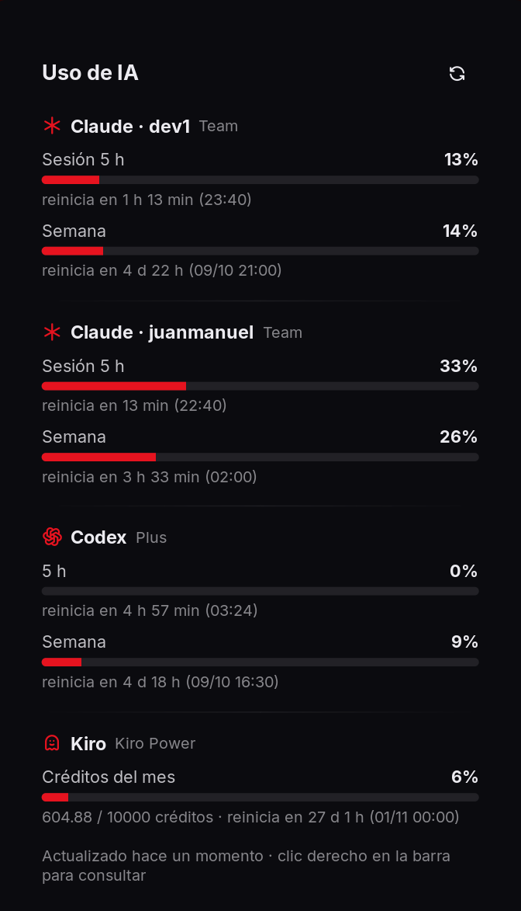

# codenotch-noctalia

**How much of your AI coding allowance is left — and is Claude still working — right in your
[Noctalia](https://github.com/noctalia-dev/noctalia) bar.**

A Linux/Wayland take on [Codenotch](https://github.com/vinzdg/codenotch) for Claude Code (every
account you use), Codex and Kiro. A tiny Rust daemon does the reading; a native Noctalia v5 plugin
draws it with your theme.

<p align="center">
  <br><br>
  
</p>

> The UI is in Spanish for now — translations are welcome (see [Contributing](#contributing)).

## Why another one

The upstream Windows/Linux port is a Tauri window: a WebKit runtime to draw a pill, forced onto
XWayland because Wayland will not let a normal window place itself on a screen edge. Your shell
already draws native layer-shell surfaces, so this one does not open a window at all:

| Piece                                                         | What it does                                                                                                                                                                   |
| ------------------------------------------------------------- | ------------------------------------------------------------------------------------------------------------------------------------------------------------------------------ |
| `codenotch daemon` — Rust, ~7 MB RSS, 1.9 MB binary, 4 crates | Polls the providers, follows Claude Code sessions through inotify, writes one `$XDG_RUNTIME_DIR/codenotch/state.json` and pings Noctalia over IPC only when something changed. |
| `juanmcanchala/codenotch` — Noctalia plugin (Luau)            | Bar widget + panel, drawn by Noctalia in your palette.                                                                                                                         |

## What it shows

**Bar:** one icon per provider (✳ Claude, one per account · OpenAI Codex · 👻 Kiro) with a thin usage
bar underneath — amber from 70 %, red from 90 %. Claude's icon pulses while a session is working,
blinks amber while one is waiting on you (a permission prompt or a question), and stays lit for
three minutes after it finishes. Hover for a one-line summary per provider, click for the panel,
right-click to read everything now. The widget's `show_percent` setting puts the numbers back in
the bar if you have the room.

**Panel:** every limit window with its percentage, a progress bar, the time it resets and a live
countdown.

**Alerts:** a desktop notification when a provider's main window crosses **80 %** and **100 %** —
once per crossing, and again only after that window has rolled over.

## What it reads

| Provider            | Source                                                                                                                                                                                                                  | How often                                                                                                                |
| ------------------- | ----------------------------------------------------------------------------------------------------------------------------------------------------------------------------------------------------------------------- | ------------------------------------------------------------------------------------------------------------------------ |
| **Claude Code**     | `api.anthropic.com/api/oauth/usage` — the endpoint behind `/usage` — with the OAuth token Claude Code keeps in `~/.claude*/.credentials.json`.                                                                          | 5 min; every minute while a session of that account is working; once right after a session stops; at every window reset. |
| **Claude sessions** | `~/.claude*/sessions/<pid>.json`, which Claude Code itself keeps up to date (`busy` / `waiting` / `idle`). The pid is checked against `/proc` so a crashed session's leftover file is ignored. **No hooks to install.** | instantly (inotify)                                                                                                      |
| **Codex**           | `chatgpt.com/backend-api/wham/usage` with the ChatGPT sign-in in `~/.codex/auth.json`.                                                                                                                                  | 5 min, and at once after `codex login`                                                                                   |
| **Kiro**            | `kiro-cli chat --no-interactive /usage`, Kiro's own report.                                                                                                                                                             | 15 min (the CLI takes a few seconds to start)                                                                            |

**Several Claude accounts.** Every `~/.claude` and `~/.claude-<slug>` directory with a sign-in is
found at start — the usual `CLAUDE_CONFIG_DIR=~/.claude-work claude` setup. Directories signed into
the _same_ account are merged into one icon (by the account's email) and read with whichever token
expires last. The default `~/.claude` account always comes first and the rest follow by email, so
the icons never swap places.

**Nothing is written, nothing is refreshed.** Credentials are opened read-only and never copied
anywhere but the request to the vendor that issued them. Renewing a token is left to the tool that
owns it: if one expires, its reading dims with its age and is read again as soon as the credentials
file changes. Sessions named `observer-sessions*` (claude-mem's background agents) and non-interactive
`claude -p` runs do not count as "working".

## The honest caveat

No vendor publishes a supported "your limit is N % used" API. Each adapter reads what the owning
tool reads itself — an internal endpoint or the CLI's own report — and those can change without
notice. Response shapes are pinned by tests, and every failure degrades to a visible state (dimmed
and stale, or an error line in the panel) rather than an invented number.

**Rate limits.** Claude's endpoint answers `429` when polled too hard, with an unhelpful
`Retry-After: 0`. That value only raises the floor: the wait starts at 60 s and doubles with every
consecutive 429, up to 15 minutes. The deadline is kept in `~/.local/state/codenotch/cache.json`, so
restarting during a penalty waits instead of spending another attempt — and a restart in general
shows the last readings instead of asking again.

## Install

Requirements: Noctalia v5 (plugin API 24+), a Rust toolchain, and the CLIs you want tracked
(`claude`, `codex`, `kiro-cli`). `notify-send` for alerts.

```sh
git clone https://github.com/JuanMCanchala/codenotch-noctalia
cd codenotch-noctalia
./install.sh
```

The script builds the daemon, installs `~/.local/bin/codenotch`, enables the
`codenotch.service` user unit, links the plugin into `~/.local/share/noctalia/plugins/codenotch`
and enables it. Then add the widget to a bar in `~/.config/noctalia/config.toml`:

```toml
[widget.codenotch]
type = "juanmcanchala/codenotch:usage"
```

and put `"codenotch"` in that bar's `start`, `center` or `end` list.

## Commands

```sh
codenotch status    # human-readable summary of the current state
codenotch refresh   # read everything now (as far as a 429 allows)
codenotch once      # read everything once, print the JSON, exit (debugging)
journalctl --user -u codenotch -f
```

## Configuration

Optional, in `~/.config/codenotch/config.json`:

```json
{
  "aliases": { "me@work.com": "work" },
  "ignore_sessions": ["observer-sessions"],
  "claude_interval": 300,
  "claude_busy_interval": 60,
  "codex_interval": 300,
  "kiro_interval": 900,
  "codex": true,
  "kiro": true,
  "alerts": true
}
```

`aliases` renames an account (by default the part of the email before the first `.`, `_` or `-`).

## Roadmap

- English/other translations of the UI.
- Several Codex accounts (`~/.codex-<slug>` with `CODEX_HOME`), as upstream does.
- More providers from upstream's list: Cursor, GitHub Copilot, OpenCode, GLM, Gemini/Antigravity.

## Contributing

Issues and PRs welcome. `cargo test` covers the parsers, the scheduling and the alert logic with
synthetic fixtures — never real credentials. The plugin hot-reloads while you edit the `.luau` files.

## Credits

The idea, the design language and much of the hard-won knowledge about each provider's endpoints
come from [Codenotch](https://github.com/vinzdg/codenotch) by Vinz (MIT). This is an independent
reimplementation for Linux and Noctalia; no code is copied from it.

## License

[MIT](LICENSE) © 2026 Juan Manuel Canchala
